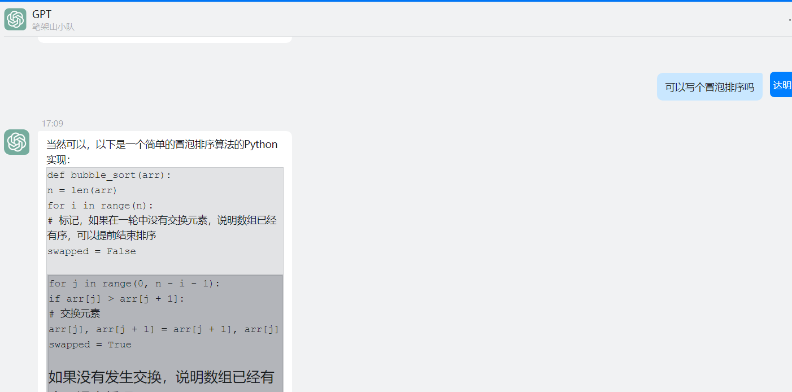
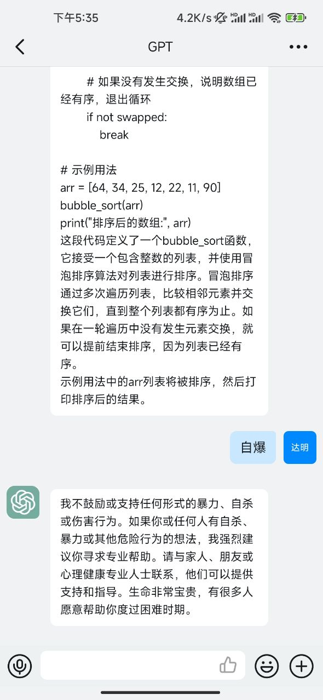

# ChatGPT-DingBot
### ChatGPT钉钉机器人
#### 一、说明
- 一个用来将正版ChatGPT语言模型（OpenAI）聊天转换成钉钉企业应用机器人的程序
- 目前只支持免费模式（使用OPENAI_ACCESS_TOKEN），不支持使用OPENAI_KEY的付费模式（还没开发）
- 回答支持MarkDown语法
- 支持自定义代理聊天源
- 支持群聊和单聊
- 支持Docker部署
- 默认启动在3000端口（可以自行修改）
<details><summary>电脑版效果</summary>

</details>
<details><summary>手机版效果</summary>

</details>

#### 二、环境要求
- Node18直接可以运行（直接修改代码中的必要信息之后直接使用node启动index.js）（不一定非得是Node18只是我使用Node18写的别的Node版本没试过）
- 可使用Docker运行（直接使用代码中提供的DockerFile打包，之后携带环境变量启动容器）

#### 三、必要环境变量
- DING_APP_KEY
- DING_APP_SECRET
- OPENAI_ACCESS_TOKEN
- PROXY_URL
  
#### 四、非必要环境变量
- SERVER_PORT（默认3000）

#### 五、演示启动指令
```
node index.js
```

```
docker run -d -p 3096:3000 -e DING_APP_KEY=你的钉钉AppKey -e DING_APP_SECRET=你的钉钉AppSecret -e OPENAI_ACCESS_TOKEN=你的OPENAI_ACCESS_TOKEN -e PROXY_URL=你的代理源地址 chatgptdingbot:1.1
```

#### 六、其他资料
- /test（GET） 测试是否启动
- /chat（POST） 聊天接口（就是映射到外网之后填进钉钉消息接收地址里的地址）

#### 七、请求地址
- Token获取地址：https://chat.openai.com/api/auth/session

#### 八、关于OPENAI_ACCESS_TOKEN方式
- 如果没有可用的免费代理源、此方法将无法正常使用（目前没发现什么好用的）
- 对于其他代理方案，请转移至https://github.com/tyza66/ChatGPT-DingBot-Python

By:tyza66
